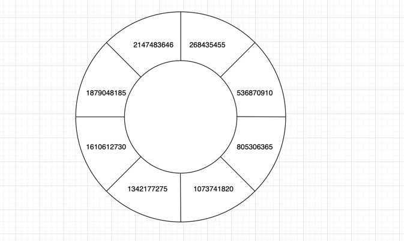

# ConsistentHash

> 一致性hash目的是解决分布式缓存的问题，个人认为一致性hash算法不是分布式中高可用问题的解决方案，而它主要是用来解决在分布式系统中寻址与动态扩所容机器时尽量少的对数据进行rehash，例如[MemCache](https://github.com/memcached/memcached)
  根据一致性hash的原理尤其需要考虑数据倾斜的问题

+ FixedHashRing
+ DynamicalHashRing（开发中）

以上两种一致性hash算法作用是用来寻址，可以用来做负载均衡服务的路由算法，基于以上两种算法，还提供了功能更强大具有缓存初始化、构建缓存的一致性hash算法

+ FixedCacheHashRing（开发中）
+ DynamicalCacheHashRing（开发中）

FixedLengthHashRing是一种在初始化阶段即确定节点在Hash环的分布状态，使得所有的虚拟节点在Hash环上均匀的分布。

## FixedHashRing
在这个hash环上均匀的分布着8个区域，每个区域的步长为268435455，通过对每个虚拟节点公平的范围分配，使得我们的数据能够均匀的分布在每个服务器节点上。这种方式的缺点是没办法进行动态扩所容，优点是数据分布非常均衡。

#### 测试数据

第一组
物理节点数量4，虚拟节点数量1000，key数量1000000
<table>
        <tr>
            <th>节点IP</th>
            <th>节点Signboard</th>
            <th>命中率</th>
        </tr>
        <tr>
            <th>127.0.0.1</th>
            <th>node1</th>
            <th>0.249486</th>
        </tr>
         <tr>
            <th>127.0.0.2</th>
            <th>node2</th>
            <th>0.250424</th>
        </tr>
         <tr>
            <th>127.0.0.3</th>
            <th>node3</th>
            <th>0.250042</th>
        </tr>
        <tr>
            <th>127.0.0.4</th>
            <th>node4</th>
            <th>0.250048</th>
        </tr>
</table>

第二组
物理节点数量8，虚拟节点数量8000，key数量1000000
<table>
        <tr>
            <th>节点IP</th>
            <th>节点Signboard</th>
            <th>命中率</th>
        </tr>
        <tr>
            <th>127.0.0.1</th>
            <th>node1</th>
            <th>0.124891</th>
        </tr>
         <tr>
            <th>127.0.0.2</th>
            <th>node2</th>
            <th>0.124831</th>
        </tr>
         <tr>
            <th>127.0.0.3</th>
            <th>node3</th>
            <th>0.124949</th>
        </tr>
        <tr>
            <th>127.0.0.4</th>
            <th>node4</th>
            <th>0.125496</th>
        </tr>
        <tr>
            <th>127.0.0.5</th>
            <th>node5</th>
            <th>0.124499</th>
        </tr>
        <tr>
            <th>127.0.0.6</th>
            <th>node6</th>
            <th>0.125062</th>
        </tr>
        <tr>
            <th>127.0.0.7</th>
            <th>node7</th>
            <th>0.125028</th>
        </tr>
        <tr>
            <th>127.0.0.8</th>
            <th>node8</th>
            <th>0.125244</th>
        </tr>
</table>